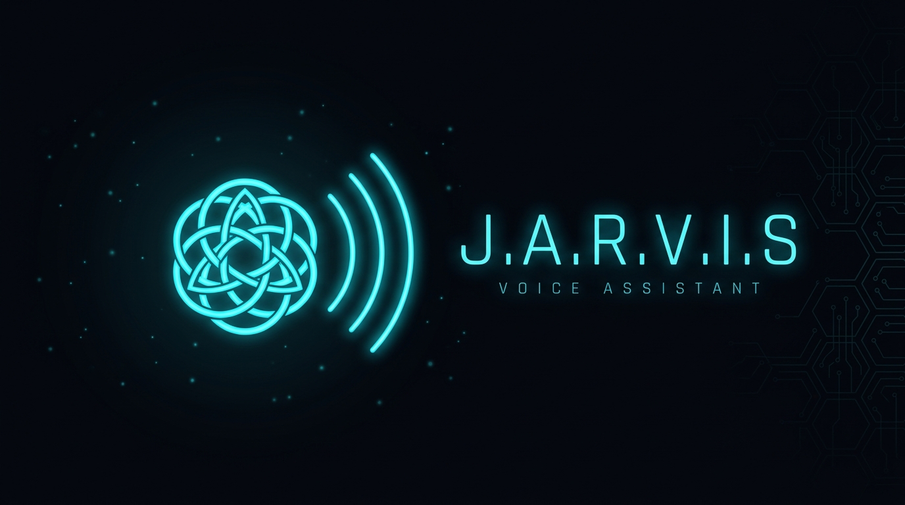

<p align="center">
  
</p>

<p align="center">
  
  
  
  
  
  
  
  
</p>

<p align="center">
  <strong>A real-time voice AI assistant with dual personas, 15 tools, and cloud-first + local fallback architecture.</strong>
</p>

---

## Architecture

```
┌─────────────────────────────────────────────┐
│  uvicorn core.server:app  (port 7860)        │
│                                              │
│  ├── POST /api/token  ← JWT token minting    │
│  ├── GET  /api/health ← health check         │
│  └── GET  /           ← React SPA (built)    │
└──────────────────┬──────────────────────────┘
                   │ (separate process)
                   ▼
┌─────────────────────────────────────────────┐
│  python -m core.worker                       │
│                                              │
│  ┌─ EAR ──────────────────────────────────┐ │
│  │  Silero VAD → Deepgram Nova-2 STT       │ │
│  │            ↘ Moonshine ONNX (fallback)  │ │
│  └────────────────────────────────────────┘ │
│  ┌─ BRAIN ─────────────────────────────────┐ │
│  │  RateLimitedGroqLLM (Llama 3.3 70B)     │ │
│  │  ↘ Gemini 2.0 Flash (fallback)          │ │
│  │  ↘ 15 function tools                    │ │
│  └────────────────────────────────────────┘ │
│  ┌─ VOICE ─────────────────────────────────┐ │
│  │  Deepgram Aura-2 TTS                    │ │
│  │  ↘ Kokoro ONNX (fallback)               │ │
│  └────────────────────────────────────────┘ │
└─────────────────────────────────────────────┘
```

## Personas

| Persona | Voice | Greeting |
|---------|-------|---------|
| **JARVIS** | Aura-2 Neptune (deep male) | *"System active. Communication channels are stable, Sir."* |
| **VERONICA** | Aura-2 Aurora (female) | *"Veronica core online. Awaiting your instructions."* |

Switch personas by using a room name containing `veronica` (e.g. `veronica-session-1234`).

## Tool Suite (15 Tools)

| # | Tool | Key Required |
|---|------|-------------|
| 1 | `get_current_time` | None |
| 2 | `get_world_time` | None |
| 3 | `get_weather_data` | None (Open-Meteo) |
| 4 | `search_web` | None (DuckDuckGo) |
| 5 | `scrape_page` | None |
| 6 | `calculate_math` | None |
| 7 | `remember_user_fact` | None (SQLite) |
| 8 | `recall_user_facts` | None (SQLite) |
| 9 | `open_website_system` | None |
| 10 | `control_media` | None |
| 11 | `add_agenda_event` | None |
| 12 | `view_agenda_events` | None |
| 13 | `search_youtube_media` | `GOOGLE_CLOUD_API_KEY` |
| 14 | `verify_claim_truth` | `GOOGLE_CLOUD_API_KEY` |
| 15 | `send_research_email` | `SENDGRID_API_KEY` + `JARVIS_EMAIL_IDENTITY` |

## Session & Memory

**Does each call restart as a new chat?**
No. `AgentSession` maintains a persistent `ChatContext` throughout the room session. Every utterance is appended, the full history is sent to the LLM each turn. When you disconnect, context ends. Next session starts fresh — but SQLite memory persists across sessions.

**Persistent Cross-Session Memory:**
`memory_db.py` + `remember_user_fact` / `recall_user_facts` tools store facts in `core/static/memory.db` (SQLite). Say *"remember my favorite color is blue"* → stored permanently. Next session: *"what's my favorite color?"* → recalled from DB.

## Quick Start (Local)

### Prerequisites
- Python 3.10+
- Node.js 20+
- [LiveKit Cloud account](https://cloud.livekit.io) (free tier works)
- [Groq API key](https://console.groq.com) (free tier works)
- [Deepgram API key](https://console.deepgram.com) (free tier works)

### 1. Clone & Install
```bash
git clone https://github.com/Nawaz-khan-droid/Personal-AI-Assistant.git
cd Personal-AI-Assistant
pip install -r requirements.txt
cd frontend && npm install && npm run build && cd ..
```

### 2. Configure Environment
```bash
cp .env.example .env
# Edit .env with your API keys
```

### 3. Run
```bat
start_local.bat
```
Then open `http://localhost:7860` and enter your `JARVIS_UI_PASSWORD`.

## Required Environment Variables

Set these as **Repository Secrets** in HF Spaces (Settings → Variables and secrets):

| Variable | Description | Required |
|----------|-------------|----------|
| `LIVEKIT_URL` | LiveKit Cloud WebSocket URL (`wss://...`) | ✅ |
| `LIVEKIT_API_KEY` | LiveKit Cloud API key | ✅ |
| `LIVEKIT_API_SECRET` | LiveKit Cloud API secret | ✅ |
| `GROQ_API_KEY` | Groq API key (LLM + STT) | ✅ |
| `DEEPGRAM_API_KEY` | Deepgram API key (TTS + STT) | ✅ |
| `JARVIS_UI_PASSWORD` | Password to access the UI | ✅ |
| `GEMINI_API_KEY` | Gemini 2.0 Flash (LLM fallback) | Optional |
| `GOOGLE_CLOUD_API_KEY` | YouTube search + Google Fact Check | Optional |
| `SENDGRID_API_KEY` | Email dispatch tool | Optional |
| `JARVIS_EMAIL_IDENTITY` | Sender address for email tool | Optional |
| `GROQ_LLM_MODEL` | Override LLM model (default: `llama-3.3-70b-versatile`) | Optional |
| `DEEPGRAM_TTS_MODEL` | Override TTS model (default: `aura-2-neptune-en`) | Optional |

## Project Structure

```
jarvis-assistant/
├── core/
│   ├── config.py          # Pydantic settings, .env validation
│   ├── server.py          # FastAPI: POST /api/token + SPA serving
│   └── worker.py          # LiveKit agent: pipeline + tool orchestration
├── profiles/
│   ├── base_profile.py    # Abstract profile interface
│   └── jarvis_personal.py # JARVIS/Veronica personas + 15 tools
├── services/
│   ├── fallback_stt.py    # Moonshine ONNX STT (offline fallback)
│   ├── fallback_tts.py    # Kokoro ONNX TTS (offline fallback)
│   └── memory_db.py       # SQLite persistent memory wrapper
├── frontend/              # React + Vite + LiveKit Components
├── assets/
│   ├── banner.png         # GitHub README banner
│   └── icon.png           # App icon / HF Space avatar
├── Dockerfile             # Multi-stage: Node 20 build → Python 3.10
├── requirements.txt
├── start_local.bat        # Windows local dev launcher
└── startup.sh             # Linux/Docker launcher
```

## Deployment to Hugging Face Spaces

1. Create a new Space at [huggingface.co/new-space](https://huggingface.co/new-space) — SDK: **Docker**
2. Push this repo to the Space remote
3. Set all required secrets in **Settings → Variables and secrets**
4. Watch the **Logs** tab — look for:
   ```
   INFO: Uvicorn running on http://0.0.0.0:7860
   JARVIS worker starting...
   ```

## End-to-End Test Checklist

```
[ ] Space builds successfully (no Docker errors in Logs)
[ ] Space URL loads React login page
[ ] Wrong password → "Unauthorized" error
[ ] Correct password → room created, voice UI appears
[ ] JARVIS persona: deep male TTS voice
[ ] Veronica persona: female TTS voice
[ ] "What time is it?" → get_current_time tool fires
[ ] "What's the weather in London?" → get_weather_data fires
[ ] "Remember my favorite color is blue" → stored in SQLite
[ ] "What's my favorite color?" → recalled from SQLite
[ ] "Search for latest AI news" → search_web fires
[ ] Barge-in works (interrupt mid-sentence, it stops)
[ ] /api/health returns {"status": "ok", ...}
[ ] Container stable after 5 min idle
```

---

<p align="center">
  <sub>Built with LiveKit Agents · Groq · Deepgram · React · FastAPI</sub>
</p>
